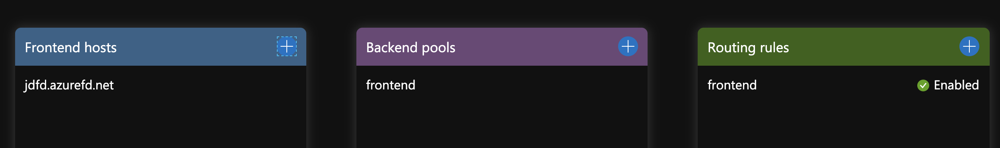
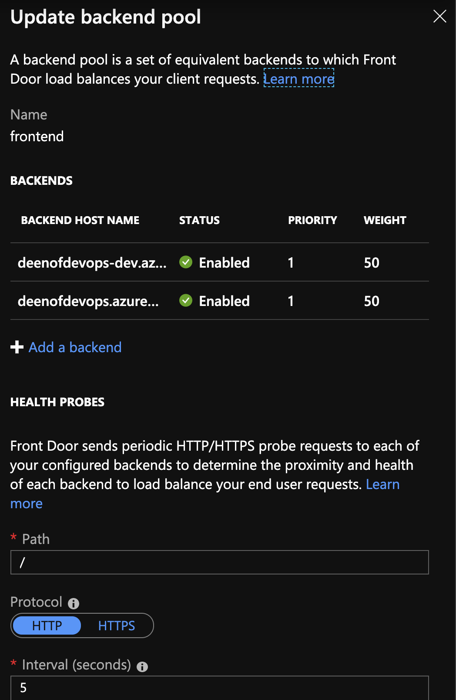
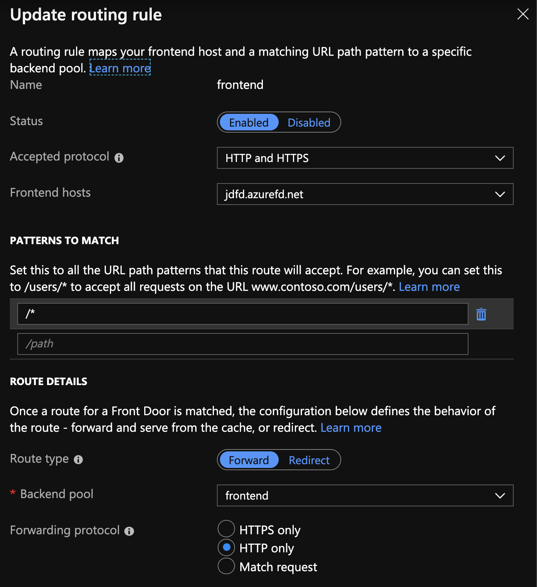
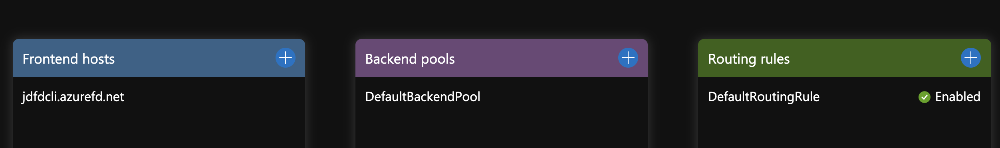
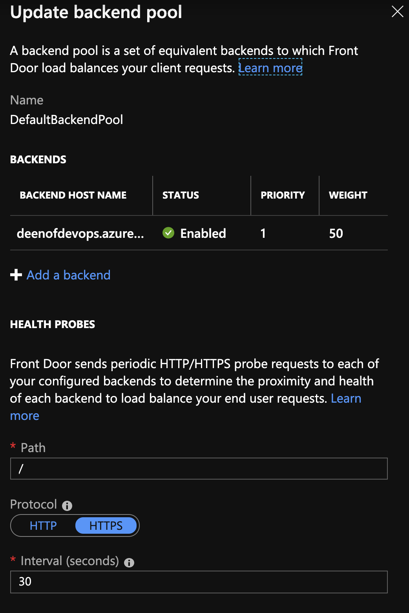
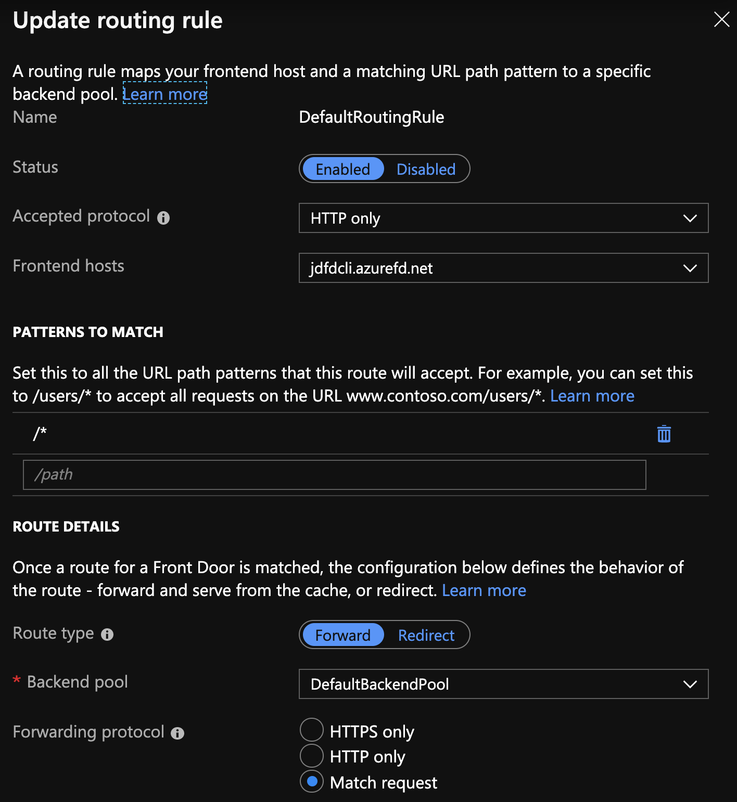

# Azure Front Door

## ARM Template

To use this script, you will need to fill in the variables in the `applytemplate.sh` script. You may also need to make the appropriate edits to the `template.json` for the Azure Frontdoor infra setup. Settings you may need to edit are lines 41-45 for frontend host1:

```json
"enabledState": "Enabled",
"httpPort": 80,
"httpsPort": 443,
"priority": 1,
"weight": 50
```
and lines 50-54 for frontend host2:

```json
"enabledState": "Enabled",
                    "httpPort": 80,
                    "httpsPort": 443,
                    "priority": 1,
                    "weight": 50
```

This will create a Front Door that looks like this:


<!--  -->

Your backend will look like this:


<!--  -->

Your routing rules will look like this:


<!--  -->

## Azure CLI

As of the time of this writing, you can create an Azure Frontdoor via Azure CLI with the frontdoor network extension only. To use this simply run `az extension add --name front-door`. This will take your azcli network module from version `2.5.1` to version `2.5.2` and provide you a new front-door azcli module of version `0.1.7`. I am using Azure CLI version `2.0.67`, which is the latest azcli version at this time, to test.

Detailed documentation on Azure CLI FrontDoor commands can be found [here](https://docs.microsoft.com/en-us/cli/azure/ext/front-door/network/front-door?view=azure-cli-latest). The source code for the FrontDoor CLI extension can be found [here](https://github.com/Azure/azure-cli-extensions/tree/master/src/front-door).

Then, to create a simple frontdoor to one backend address, I used the following command:

```
az network front-door create \
--backend-address fqdn-of-backend-here \
--name front-door-name-here \
--resource-group resource-group-here
```

An example of the above would be:
```
az network front-door create \
--backend-address deenofdevops.azurewebsites.net \
--name jdfdcli \
--resource-group jdfdclitest
```

This will create a Front Door that looks like this:



Your backend will look like this:


<!--  -->

Your routing rules will look like this:


<!--  -->